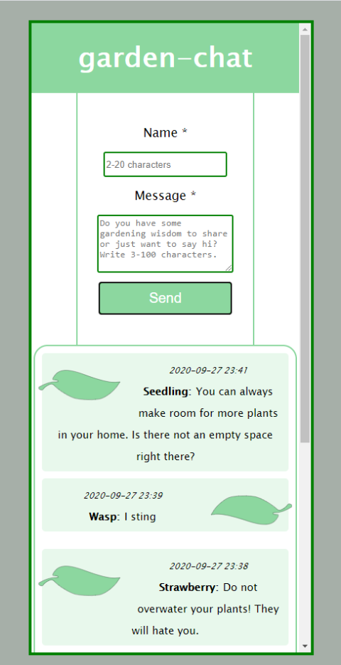

# garden-chat

A small webapp I created for learning JQuery and JMS.
The frontend is created with HTML, CSS, JavaScript and JQuery. The backend is a SpringBoot REST api, written in Java.

There is still a bit left to do until it is ready for production.
But if you want to try it out in its current state and have a nice little conversation with yourself, follow the instructions below.

- Clone this repo.
- Make sure you are on the master branch, then run the application with Maven:
- `mvn clean install`
- `./mvnw spring-boot:run`

After startup the client can be found at localhost:8080/garden-chat-api/chatclient/index.html

